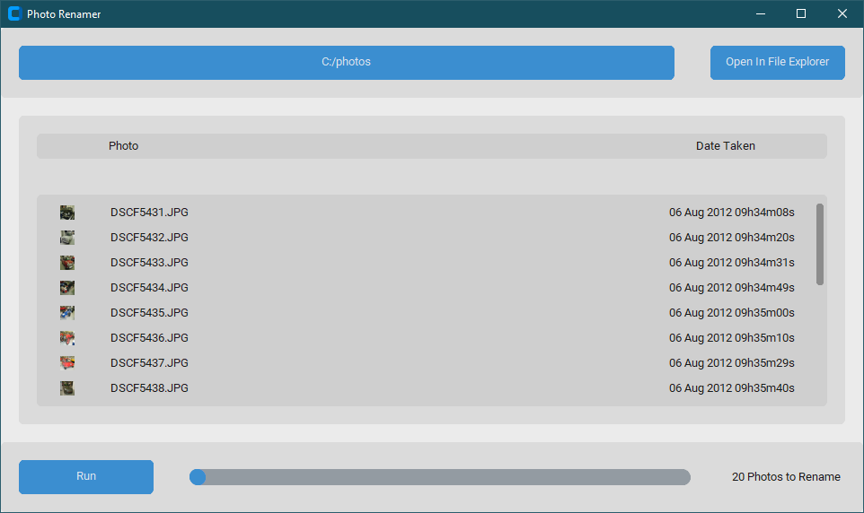

# Photo Renamer

Renames `png` and `jpg` files to the date they were taken using the format `%d %b %Y %Hh%Mm%Ss`, e.g., `09 Aug 2023 12h36m01s`.

Useful when printing photos (some companies print the file name on the back).

Built for windows, user interface made with tkinter.

To generate a standalone executeable run `pyinstaller --onefile --noconsole main.py`. Use the included utility file `startmenu_shortcut.py` for generating a start menu shortcut for the executable.

## Preview

